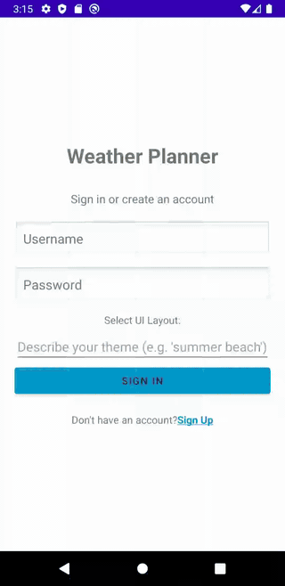
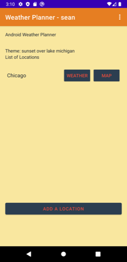
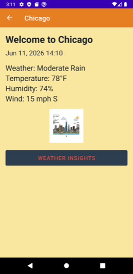
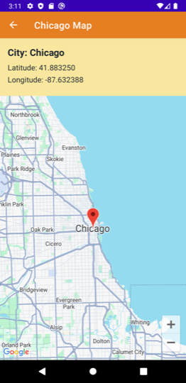
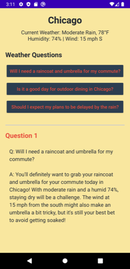

# Android Weather Planner

[](https://github.com/SeanKraemer/android-app/actions/workflows/ci.yml)

A Java Android app for planning around weather: save a per-user city watchlist, view live current conditions, open an interactive city map, and get AI-generated weather insights and imagery. Built on SQLite + ContentProvider persistence, OpenWeatherMap, the Google Maps SDK, and the Gemini API — with deterministic demo fallbacks so every screen works with zero API keys configured. Originated as the team project for UIUC's CS 427 Software Engineering graduate course (Fall 2025); this is the public portfolio copy.



*One take: sign in, search and save a city, open live OpenWeatherMap conditions, jump to the Google Maps view, then ask Gemini context-aware questions about the day's weather.*

| City watchlist | Weather details | Map view | Gemini insights |
|---|---|---|---|
|  |  |  |  |

---

## Features

- Local sign-up and sign-in backed by SQLite.
- Per-user saved city lists through a ContentProvider.
- Per-user visual themes generated from natural language prompts when Gemini is configured.
- Weather details powered by OpenWeatherMap when configured, with local demo weather when no key is present.
- Weather insight questions and answers powered by Gemini when configured, with local demo responses when no key is present.
- Weather-aware image generation through Gemini when configured, with a local generated image fallback for no-key demos.
- City map screen powered by Google Maps SDK when configured, with coordinate-only demo mode when no Maps key is present.

## Architecture

The app is a single Android application module using Java, AndroidX AppCompat, SQLite, OkHttp, Gson, Google Maps SDK, and Gemini client libraries.

- `LoginActivity` and `SignUpActivity` manage local account flow and optional theme generation.
- `MainActivity` displays the signed-in user's city list and routes to weather or map views.
- `DetailsActivity` fetches weather data, renders the weather card, and starts AI image generation.
- `WeatherInsightsActivity` displays generated question buttons and answers.
- `MapActivity` renders the saved city on Google Maps, or a coordinate-only demo view.
- `UserDatabaseHelper`, `LocationDbHelper`, `LocationProvider`, and `LocationContract` manage local persistence.
- `WeatherApiService`, `ThemeGenerator`, `WeatherInsightsGenerator`, and `WeatherImageGenerator` isolate external API behavior and demo fallbacks; `GeminiJson` handles the markdown-fence cleanup Gemini responses sometimes need before JSON parsing.

## Quickstart

Open the project in Android Studio, or configure the command line:

```bash
cp local.properties.example local.properties
```

Edit `local.properties`:

```properties
sdk.dir=/path/to/Android/sdk
GEMINI_API_KEY=
OPENWEATHERMAP_API_KEY=
MAPS_API_KEY=
```

Leaving API keys blank enables demo mode. The app still builds and can be reviewed without live Gemini, OpenWeatherMap, or Google Maps calls.

```bash
./gradlew :app:testDebugUnitTest   # JVM unit tests
./gradlew :app:assembleDebug       # build the debug APK
./gradlew :app:lintDebug           # Android lint
```

To run it: start an emulator (a recent Pixel image on API 29+), then `./gradlew :app:installDebug` or click Run in Android Studio. Create a local account, sign in, add a city, and open Weather, Weather Insights, and Map.

## Credentials And API Setup

Only add keys to `local.properties`; never commit real values. All three are optional — each feature degrades to a deterministic demo fallback without its key.

- `GEMINI_API_KEY` — theme generation, weather insight Q&A, and weather-aware city images. Text uses `gemini-2.5-flash-lite`; images use `imagen-4.0-fast-generate-001`. Create a key in [Google AI Studio](https://aistudio.google.com/app/apikey) and set low quota limits.
- `OPENWEATHERMAP_API_KEY` — live current weather. Use a free-tier key for demos; production would proxy weather calls through a backend instead of shipping the key in the APK.
- `MAPS_API_KEY` — the interactive map screen. Enable Maps SDK for Android in Google Cloud and restrict the key to package `com.weatherplanner.app` plus your debug/release certificate SHA-1 (`keytool -list -v -alias androiddebugkey -keystore ~/.android/debug.keystore -storepass android -keypass android`).

## Testing

```bash
./gradlew :app:testDebugUnitTest     # JVM unit tests (JSON parsing, weather formatting)
./gradlew connectedDebugAndroidTest  # Espresso suite; needs an emulator or device
```

CI (GitHub Actions) runs unit tests, the debug build, and lint on every push and pull request. The Espresso suite (~1,600 lines across login, sign-up, city management, weather, map, and logout flows) runs locally against an emulator.

Manual QA checklist:

- Create two local users with different theme prompts; sign in/out and confirm the session clears while accounts persist.
- Add, view, and remove saved cities for each user.
- With blank keys: confirm demo weather, local image fallback, demo insight Q&A, and the coordinate-only map view.
- With live keys: re-check weather, Gemini theme/insight/image generation, and interactive map behavior.

## Design Notes & Limitations

- **API keys live in `BuildConfig`** — fine for a local demo, but any key shipped in an APK is extractable. A production build would proxy OpenWeatherMap and Gemini calls through a backend and keep only the (package+SHA-1-restricted) Maps key on device.
- **Activity-centric architecture, no ViewModel layer.** State lives in activities and survives via SQLite/SharedPreferences rather than `ViewModel`/`SavedStateHandle`. Honest trade-off from the project's scope; a rewrite would adopt MVVM with Room.
- **Passwords are stored in plaintext in the local SQLite database.** The account system exists to demonstrate per-user data isolation on a single device — there is no server, and this is not an auth implementation to copy. A real app would at minimum salt-and-hash with a KDF, or use Credential Manager.
- **City local time is approximated from longitude** (15° ≈ 1 hour) rather than the API's timezone offset field, so it can be off near timezone boundaries.
- **Gemini responses are parsed defensively**: the model sometimes wraps JSON in markdown fences despite instructions, so responses are stripped before parsing and invalid payloads fall back to error handling rather than crashing.
- **The ContentProvider is internal-only.** It exists to demonstrate the component (course requirement) — a single-app design would normally talk to SQLite directly or use Room.

## License

MIT — see [LICENSE](LICENSE). Course context: this began as a collaborative CS 427 (UIUC, Fall 2025) team project; this repository is my independently maintained public copy, with identities, configuration, and history sanitized for publication.
